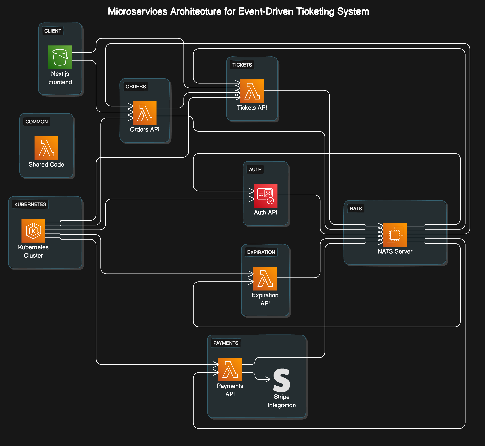
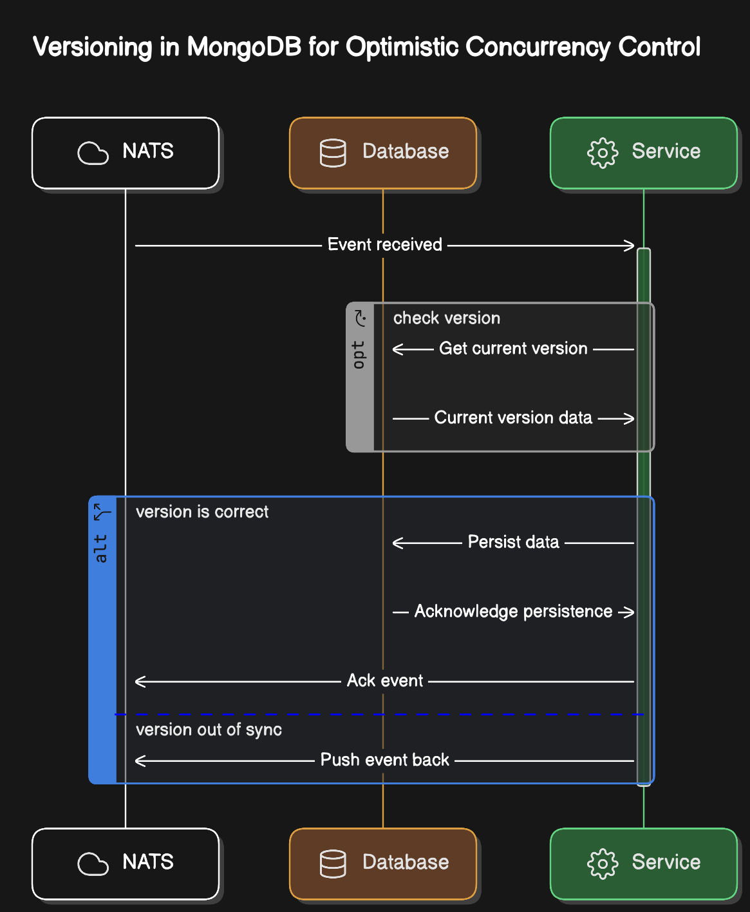

# Ticketing System

## Project Overview
This project is a ticketing system implemented using an event driven microservices architecture, leveraging a variety of technologies to manage ticket sales and related operations effectively.

## Folder Structure and Services
Here's a detailed explanation of each folder and service in the repository:

### auth
- Manages user authentication and authorization.
- Handles sign-up, sign-in, and sign-out functionalities.
- Provides JWT tokens for authenticated requests.

### client
- Frontend application built with Next.js.
- Interacts with backend services to display data and handle user actions.
- Manages client-side routing and state management.

### common
- Contains shared code and utilities used across different services.
- Includes common middlewares, error handling mechanisms, and event definitions.

### expiration
- Handles the expiration of orders that are not completed within a specified time.
- Publishes expiration events to notify other services about order expiration.

### infra
- Infrastructure-related configurations and scripts.
- Includes Kubernetes configuration files and Skaffold setup for development workflow.

### orders
- Manages the lifecycle of orders, including creation, updating, and deletion.
- Ensures that tickets are reserved and manages the order status.

### payments
- Handles payment processing for orders.
- Integrates with external payment gateways to process transactions.

### tickets
- Manages ticket creation, updating, and deletion.
- Ensures tickets are available for purchase and correctly reserved for orders.

## Microservices Communication
The microservices communicate asynchronously using NATS (a messaging system), allowing for an event-driven architecture. Each service publishes and subscribes to events, facilitating inter-service communication without direct dependencies.

## Asynchronous Data Replication Using NATS
NATS streams events related to various operations (e.g., ticket creation, order expiration). Services subscribe to these events to update their state accordingly, ensuring eventual consistency across the system.

## Concurrency Handling with Optimistic Concurrency Control
Concurrency issues are managed using optimistic concurrency control. This technique involves versioning records (e.g., tickets). When updating a record, the service checks the version to ensure no other service has modified it. If the version doesn't match, the update is rejected, preventing conflicting changes.

## Diagrams
### Microservices Architecture


### Concurrency Control


## Video Demo


## Installation
Clone the repository:
```bash
git clone https://github.com/bharath6365/ticketing.git

npm install


